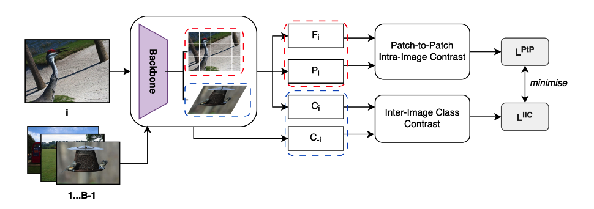
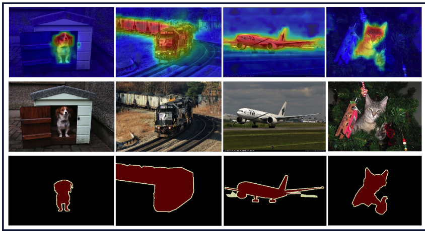

# Contrastive MCTFormer (DICTA2023)

[Contrastive MCTFormer](https://ieeexplore.ieee.org/abstract/document/10410942), proposed in DICTA2023 (Best Paper Runner Up), is an extension to the CVPR2022 paper [MCTFormer](https://arxiv.org/abs/2203.02891). We extend MCTFormer via a contrastive-aware learning framework and show improvements over the baseline on the PASCAL VOC2012 segmentation dataset. 

<p align="center">
  
</p>
<p align = "center">
Contrastive MCTFormer Overview
</p>

## Updates
 - 10/12/2023: Won Best Paper Runner Up at DICTA2023 ([paper](https://ieeexplore.ieee.org/abstract/document/10410942))


## Environment Setup
- Ubuntu 18.04, with Python 3.6 and the following python dependencies.
```
pip install -r requirements.txt
```
## Data Preparation 
<details>
<summary>
PASCAL VOC 2012
</summary>

- Download [the PASCAL VOC 2012 development kit](http://host.robots.ox.ac.uk/pascal/VOC/voc2012).
  ``` bash
  wget http://host.robots.ox.ac.uk/pascal/VOC/voc2012/VOCtrainval_11-May-2012.tar
  tar –xvf VOCtrainval_11-May-2012.tar
  ```
- Download augmented annoations `SegmentationClassAug.zip` from [SBD dataset](https://ieeexplore.ieee.org/stamp/stamp.jsp?arnumber=6126343&casa_token=cOQGLW2KWqUAAAAA:Z-QHpQPf8Pnb07A75yBm2muYjqJwYUYPFbwwxMFHRcjRX0zl45kEGNqyTEPH7irB2QbabZbn&tag=1) via this [link](https://www.dropbox.com/s/oeu149j8qtbs1x0/SegmentationClassAug.zip?dl=0).
- Make your data directory like this below
  ``` bash
  VOCdevkit/
  └── VOC2012
      ├── Annotations
      ├── ImageSets
      ├── JPEGImages
      ├── SegmentationClass
      ├── SegmentationClassAug
      └── SegmentationObject
    ```

  </details>

## Usage

### End-to-End Evaluation
```
bash scripts/run.sh
```
Runs the whole evaluation suite:
 - Trains MCTFormer V1 and V2 with the contrastive-aware framework
 - Generates class-specific localisation maps
 - Evaluates the generated localisation maps

These localisation maps can then be evaluated as below.
<p align="center">
  
</p>
<p align = "center">
Example Evaluation on PASCAL VOC2012
</p>

## Contact
[Pranav.Pativada@anu.edu.au](Pranav.Pativada@anu.edu.au)

## Citation
Consider citing if this is useful to your research or development.
```
@INPROCEEDINGS{10410942,
  author={Pativada, Pranav and Hayder, Zeeshan and Zia, Ali and Barnes, Nick},
  booktitle={2023 International Conference on Digital Image Computing: Techniques and Applications (DICTA)}, 
  title={Contrastive-Aware ViT for Weakly Supervised Semantic Segmentation}, 
  year={2023},
  volume={},
  number={},
  pages={1-8},
  keywords={Visualization;Semantic segmentation;Semantics;Self-supervised learning;Transformers;Cams;Task analysis;Weakly supervised semantic segmentation;ViT;Contrastive learning},
  doi={10.1109/DICTA60407.2023.00010}
}
```